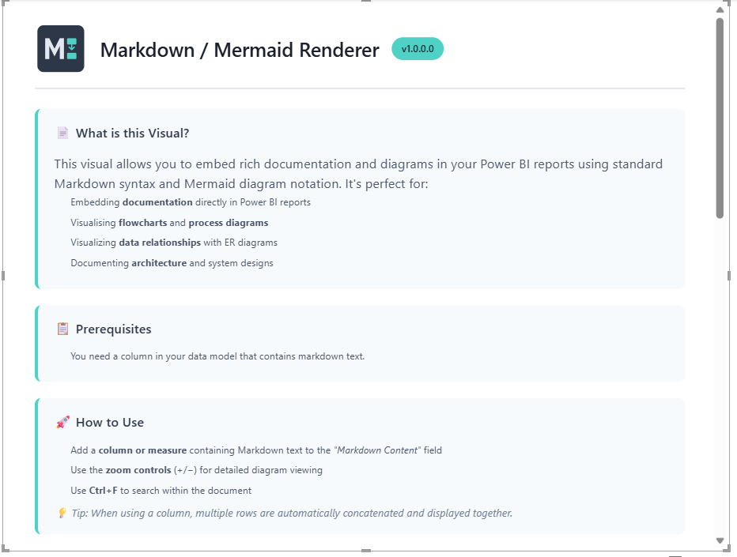
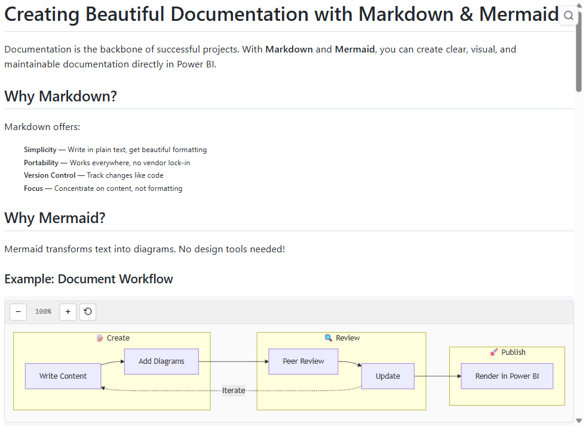
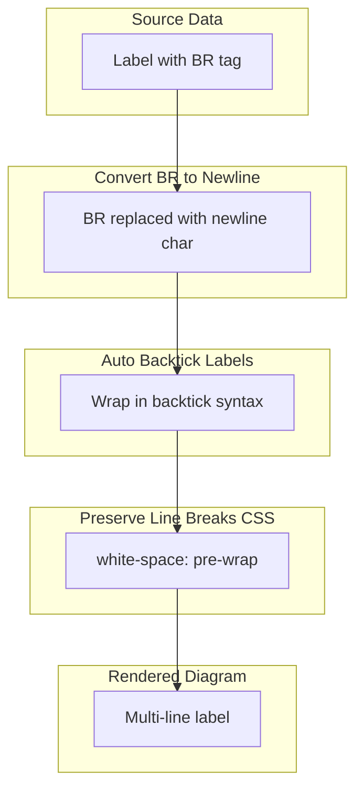
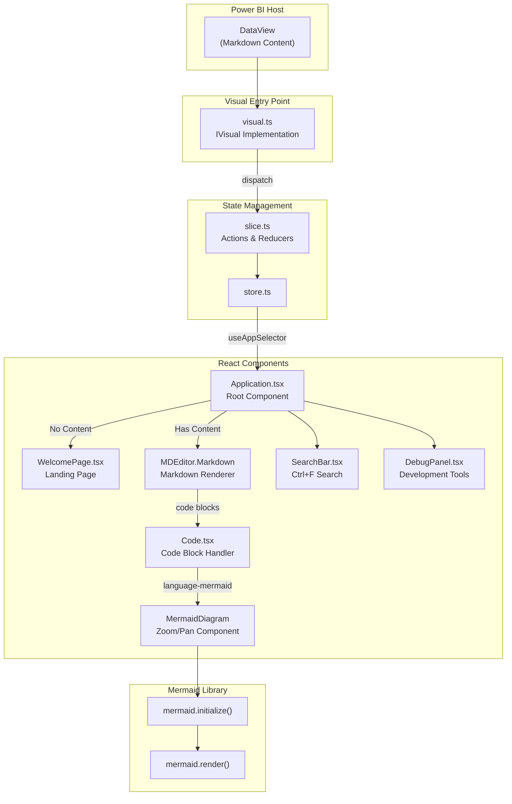
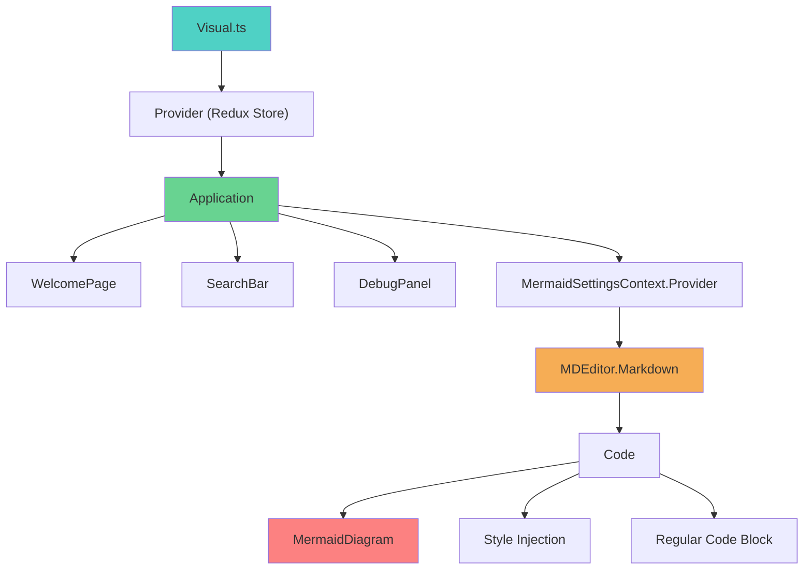
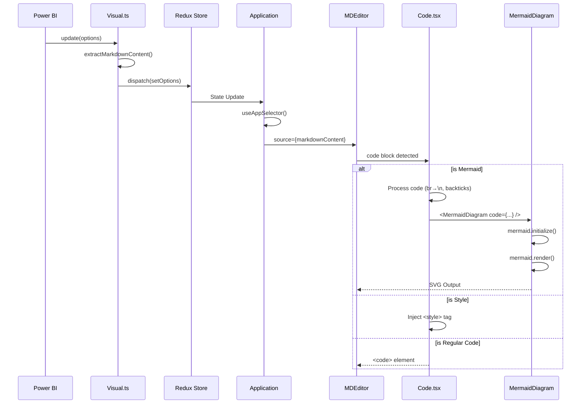
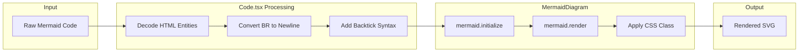
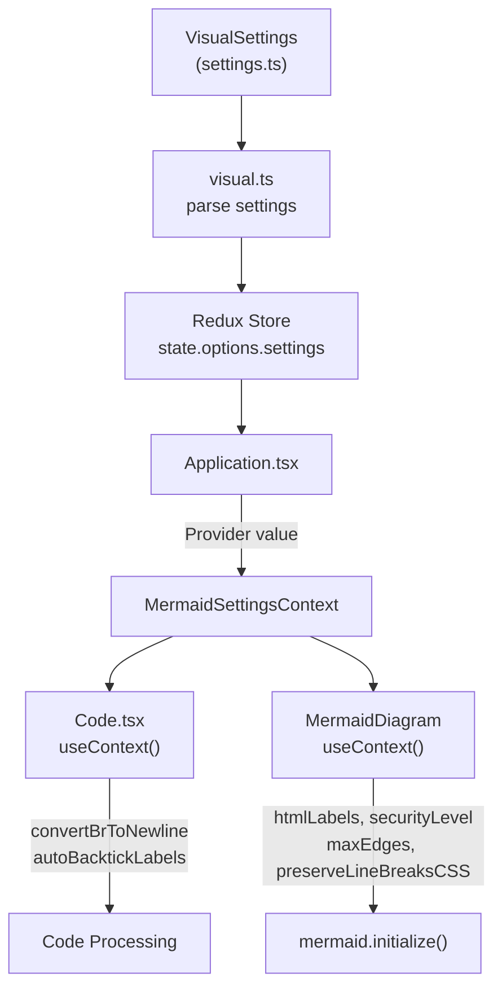
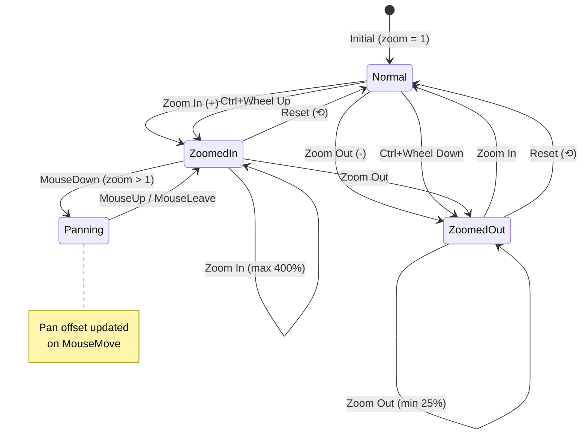

# Markdown / Mermaid Renderer for Power BI


A Power BI custom visual that renders **Markdown** content with embedded **Mermaid diagrams**. Transform your text-based content into beautifully formatted documentation, flowcharts, sequence diagrams, and more — directly within your Power BI reports.

## 📄 What is this Visual?

This visual allows you to embed rich documentation and diagrams in your Power BI reports using standard Markdown syntax and Mermaid diagram notation. It's perfect for:

- Embedding **documentation** directly in Power BI reports
- Visualising **flowcharts** and **process diagrams**
- Visualizing **data relationships** with ER diagrams
- Documenting **architecture** and system designs
- Presenting **DAX** and **Power Query (M)** code with syntax highlighting
- Supporting **dark and light themes** to match your report design

## Prerequisites
- You need a column in your data model that contains markdown text.

## 🚀 How to Use

1. Add a **column or measure** containing Markdown text to the *"Markdown Content"* field
4. Use the **zoom controls** (+/−) for detailed diagram viewing
5. Use **Ctrl+F** to search within the document

> 💡 **Tip:** When using a column, multiple rows are automatically concatenated and displayed together.

### Example Markdown with Mermaid

```markdown
# Project Status

Here's the current workflow:

` ` `mermaid
flowchart LR
    A["Data Input"] --> B["Processing"]
    B --> C["Output"]
` ` `

## Details

- Step 1: Gather data
- Step 2: Process
- Step 3: Deliver
```
### DAX & Power Query Syntax Highlighting

The visual supports syntax highlighting for **DAX** and **Power Query (M)** code blocks — ideal for documenting measures, calculated columns, or ETL logic directly in your reports.

**DAX** — use ` ```dax `:

```dax
Total Sales =
VAR _sales = SUMX(Sales, Sales[Quantity] * Sales[UnitPrice])
RETURN
    IF(_sales > 0, _sales, BLANK())
```

**Power Query (M)** — use ` ```powerquery `, ` ```pq `, or ` ```mscript `:

```powerquery
let
    Source = Sql.Database("server", "db"),
    Filtered = Table.SelectRows(Source, each [Status] = "Active")
in
    Filtered
```

## 🎨 Dark / Light Theme

The visual supports **dark and light themes** via the "Color mode" setting in the Power BI property pane. When set to dark mode:

- Markdown content renders with light text on a dark background
- Mermaid diagrams automatically use the Mermaid dark theme
- Search bar, debug panel, and all UI components adapt accordingly

> 💡 **Tip:** Match the color mode to your Power BI report background for a seamless look.
## � Examples

The folder [`pbi_example/`](pbi_example/) contains a sample Power BI report (`.pbix`) and screenshots that demonstrate the visual in action.

### Landing Page

When no data is connected, the visual displays a landing page with usage instructions and a built-in demo:



### Rendered Markdown with Mermaid Diagrams

Once a Markdown column or measure is added, the visual renders the content with full Mermaid diagram support:



## 🎯 Built-in Demo

The visual includes a **Markdown / Mermaid Demo** section on the landing page. When no data is connected, you can:

1. View the **raw Markdown source** to see the syntax for headings, lists, tables, and Mermaid code blocks
2. Click **"Render"** to see how the Markdown is rendered with live diagrams
3. Click **"Copy Markdown"** to copy the demo text to your clipboard

This lets you quickly try out the visual by pasting the demo content into a column in your data model.

## 💡 Tip: Use AI to Generate Documentation

You can use AI tools (e.g. ChatGPT, GitHub Copilot, Claude) to automatically document your project as **Markdown with embedded Mermaid diagrams**. For example, ask the AI to:

- Generate a **flowchart** of your ETL process
- Create an **ER diagram** of your data model
- Document your **architecture** as a sequence diagram
- Summarize **business logic** with structured Markdown

Copy the generated Markdown into a **separate table** in your Power BI data model (e.g. a `Documentation` table with a single text column) and connect it to this visual. This way, your technical documentation lives directly inside your Power BI report — always up to date and easy to maintain.

Uh - And now guess only once how this file has been generated...

## �📦 Libraries & Versions

| Library | Version |
|---------|---------|
| Mermaid | 11.12.3 |
| React | 18.2.0 |
| react-md-editor | 4.0.4 (Markdown rendering) |
| Handlebars | 4.7.8 |
| DOMPurify | 3.2.6 |

---

## ⚙️ Configuration Settings

### View Settings

| Setting | Type | Default | Description |
|---------|------|---------|-------------|
| **Show debug panel** | Boolean | `false` | Shows debug information including raw and processed Mermaid code |
| **Color mode** | Enum | `Light` | Switch between light and dark theme for the visual. Affects Markdown rendering, Mermaid diagrams, and all UI components. |

### Mermaid Settings

| Setting | Type | Default | Description |
|---------|------|---------|-------------|
| **Flowchart orientation** | Enum | `Default (from diagram)` | Override the orientation of flowchart diagrams. Choose between Top to Bottom, Bottom to Top, Left to Right, or Right to Left. 'Default' uses the orientation defined in the diagram code. |
| **Max edges** | Number | `30000` | Maximum number of edges allowed in a diagram |
| **Security level** | Enum | `Loose` | Security level for Mermaid rendering: `Loose`, `Strict`, or `Sandbox`. Loose is required for click handlers. |

### Mermaid Debug Settings

| Setting | Type | Default | Description |
|---------|------|---------|-------------|
| **HTML labels** | Boolean | `true` | Enable HTML rendering in node labels. Required for rich text formatting in labels. |
| **Markdown auto wrap** | Boolean | `true` | Enable automatic line wrapping in markdown labels |
| **Convert &lt;br&gt; to newline** | Boolean | `true` | Converts `<br/>` tags to newlines. Mermaid escapes `<br>` as text, this fixes line breaks. |
| **Auto backtick labels** | Boolean | `true` | Automatically wraps labels containing newlines in backticks. Mermaid only renders newlines in backtick-wrapped labels. |
| **Preserve line breaks CSS** | Boolean | `true` | Applies CSS to preserve line breaks in Mermaid labels (`white-space: pre-wrap`) |

### Font Settings

| Setting | Type | Default | Description |
|---------|------|---------|-------------|
| **Font family** | Font | `DIN` | Font family for Markdown content and Mermaid diagrams |
| **Heading font size (h1)** | Number | `14` | Font size in pt for the largest heading (h1). Smaller headings (h2–h6) scale down proportionally relative to the body font size. |
| **Body font size** | Number | `9` | Font size in pt for paragraphs, tables, lists, and other body text. |
| **Mermaid font size** | Number | `14` | Font size in pt for text in Mermaid diagrams. |

### Markdown Settings

| Setting | Type | Default | Description |
|---------|------|---------|-------------|
| **Enable line breaks** | Boolean | `true` | Render single line breaks in Markdown as `<br>` (line break). When disabled, consecutive lines are joined into one paragraph. |
| **Code block word wrap** | Boolean | `true` | Wrap long lines in code blocks instead of showing a horizontal scrollbar |

### Line Break Settings Explained

The three line-break settings work together to ensure `<br/>` tags render correctly in Mermaid diagrams:


```mermaid
flowchart TD
    subgraph Input["Source Data"]
        A["Label with BR tag"]
    end
    
    subgraph S1["Convert BR to Newline"]
        B["BR replaced with newline char"]
    end
    
    subgraph S2["Auto Backtick Labels"]
        C["Wrap in backtick syntax"]
    end
    
    subgraph S3["Preserve Line Breaks CSS"]
        D["white-space: pre-wrap"]
    end
    
    subgraph Output["Rendered Diagram"]
        E["Multi-line label"]
    end
    
    A --> B --> C --> D --> E
```

**Why these are needed:**
- `htmlLabels: true` uses HTML `<foreignObject>` which escapes `<br/>` as text
- `htmlLabels: false` uses SVG `<tspan>` which handles newlines natively (but with tighter spacing)

---

## 🎨 Power BI Theme Template Support

This visual fully supports **Power BI theme templates**, allowing you to define default settings for the visual in your organization's theme file. Theme settings are applied automatically when the theme is loaded — users can still override individual settings in the property pane.

### How It Works

Power BI themes can include a `visualStyles` section that targets custom visuals by their GUID. For this visual, the GUID is:

```
markdownMermaidRenderer
```

Theme-defined values are applied as defaults. Any setting a user changes manually in the property pane takes precedence over the theme value.

### How to Apply

1. Create a `.json` file (or extend your existing theme file) with the template below
2. In Power BI Desktop, go to **View → Themes → Browse for themes**
3. Select your `.json` theme file
4. All instances of the Markdown / Mermaid Renderer visual will use the themed defaults

> 💡 **Tip:** You can combine the `visualStyles` section with other standard theme properties (colors, fonts, backgrounds) in the same file.

### Property Reference

All properties that can be themed, organized by object group:

| Object | Property | Type | Allowed Values | Default |
|--------|----------|------|----------------|---------|
| `view` | `colorMode` | enum | `"light"`, `"dark"` | `"light"` |
| `view` | `showDebugPanel` | bool | `true`, `false` | `false` |
| `font` | `fontFamily` | string | any font name | `"DIN"` |
| `font` | `headingFontSize` | number | size in pt | `14` |
| `font` | `bodyFontSize` | number | size in pt | `9` |
| `font` | `mermaidFontSize` | number | size in pt | `14` |
| `mermaid` | `flowchartOrientation` | enum | `"default"`, `"TB"`, `"BT"`, `"LR"`, `"RL"` | `"default"` |
| `mermaid` | `maxEdges` | number | any positive integer | `30000` |
| `mermaid` | `securityLevel` | enum | `"loose"`, `"strict"`, `"sandbox"` | `"loose"` |
| `mermaidDebug` | `htmlLabels` | bool | `true`, `false` | `true` |
| `mermaidDebug` | `markdownAutoWrap` | bool | `true`, `false` | `true` |
| `mermaidDebug` | `convertBrToNewline` | bool | `true`, `false` | `true` |
| `mermaidDebug` | `autoBacktickLabels` | bool | `true`, `false` | `true` |
| `mermaidDebug` | `preserveLineBreaksCSS` | bool | `true`, `false` | `true` |
| `markdown` | `enableLineBreaks` | bool | `true`, `false` | `true` |
| `markdown` | `codeBlockWordWrap` | bool | `true`, `false` | `true` |

### Full Theme Template (Copy & Paste Ready)

Copy this complete template into a `.json` file. Remove or adjust any properties you don't need — only the properties you include will be overridden.

```json
{
    "name": "My Theme with Mermaid Visual Settings",
    "visualStyles": {
        "markdownMermaidRenderer": {
            "*": {
                "view": [{
                    "colorMode": "light",
                    "showDebugPanel": false
                }],
                "font": [{
                    "fontFamily": "DIN",
                    "headingFontSize": 14,
                    "bodyFontSize": 9,
                    "mermaidFontSize": 14
                }],
                "mermaid": [{
                    "flowchartOrientation": "default",
                    "maxEdges": 30000,
                    "securityLevel": "loose"
                }],
                "mermaidDebug": [{
                    "htmlLabels": true,
                    "markdownAutoWrap": true,
                    "convertBrToNewline": true,
                    "autoBacktickLabels": true,
                    "preserveLineBreaksCSS": true
                }],
                "markdown": [{
                    "enableLineBreaks": true,
                    "codeBlockWordWrap": true
                }]
            }
        }
    }
}
```

### Minimal Example: Corporate Dark Theme

If you only want to set a few defaults (e.g. dark mode with a specific font), you only need to include those properties:

```json
{
    "name": "Corporate Dark Theme",
    "visualStyles": {
        "markdownMermaidRenderer": {
            "*": {
                "view": [{
                    "colorMode": "dark"
                }],
                "font": [{
                    "fontFamily": "Segoe UI",
                    "bodyFontSize": 11,
                    "headingFontSize": 16
                }]
            }
        }
    }
}
```

### Extending an Existing Theme

You can add the `visualStyles` block to any existing Power BI theme file. For example, if you already have a theme with custom colors:

```json
{
    "name": "My Corporate Theme",
    "dataColors": ["#1a73e8", "#34a853", "#fbbc04", "#ea4335"],
    "background": "#ffffff",
    "foreground": "#202124",
    "visualStyles": {
        "markdownMermaidRenderer": {
            "*": {
                "view": [{ "colorMode": "light" }],
                "font": [{
                    "fontFamily": "Segoe UI",
                    "bodyFontSize": 10
                }],
                "mermaid": [{
                    "flowchartOrientation": "LR"
                }]
            }
        }
    }
}
```

---

## 🛠️ Technical Documentation

### Architecture Overview


```mermaid
flowchart TB
    subgraph PowerBI["Power BI Host"]
        DV["DataView\n(Markdown Content)"]
    end
    
    subgraph Visual["Visual Entry Point"]
        VT["visual.ts\nIVisual Implementation"]
    end
    
    subgraph Redux["State Management"]
        ST["store.ts"]
        SL["slice.ts\nActions & Reducers"]
    end
    
    subgraph React["React Components"]
        APP["Application.tsx\nRoot Component"]
        WP["WelcomePage.tsx\nLanding Page"]
        MD["MDEditor.Markdown\nMarkdown Renderer"]
        CODE["Code.tsx\nCode Block Handler"]
        MERM["MermaidDiagram\nZoom/Pan Component"]
        SB["SearchBar.tsx\nCtrl+F Search"]
        DP["DebugPanel.tsx\nDevelopment Tools"]
    end
    
    subgraph Mermaid["Mermaid Library"]
        MI["mermaid.initialize()"]
        MR["mermaid.render()"]
    end
    
    DV --> VT
    VT -->|"dispatch"| SL
    SL --> ST
    ST -->|"useAppSelector"| APP
    APP -->|"No Content"| WP
    APP -->|"Has Content"| MD
    MD -->|"code blocks"| CODE
    CODE -->|"language-mermaid"| MERM
    MERM --> MI --> MR
    APP --> SB
    APP --> DP
```

### Component Hierarchy


```mermaid
flowchart TD
    V["Visual.ts"] --> P["Provider (Redux Store)"]
    P --> A["Application"]
    A --> W["WelcomePage"]
    A --> S["SearchBar"]
    A --> D["DebugPanel"]
    A --> CTX["MermaidSettingsContext.Provider"]
    CTX --> M["MDEditor.Markdown"]
    M --> C["Code"]
    C --> MD["MermaidDiagram"]
    C --> ST["Style Injection"]
    C --> CD["Regular Code Block"]
    
    style V fill:#4FD1C5
    style A fill:#68D391
    style M fill:#F6AD55
    style MD fill:#FC8181
```

### Data Flow


```mermaid
sequenceDiagram
    participant PBI as Power BI
    participant V as Visual.ts
    participant R as Redux Store
    participant A as Application
    participant M as MDEditor
    participant C as Code.tsx
    participant D as MermaidDiagram
    
    PBI->>V: update(options)
    V->>V: extractMarkdownContent()
    V->>R: dispatch(setOptions)
    R->>A: State Update
    A->>A: useAppSelector()
    A->>M: source={markdownContent}
    M->>C: code block detected
    
    alt is Mermaid
        C->>C: Process code (br→\n, backticks)
        C->>D: <MermaidDiagram code={...} />
        D->>D: mermaid.initialize()
        D->>D: mermaid.render()
        D-->>M: SVG Output
    else is Style
        C->>C: Inject <style> tag
    else is Regular Code
        C-->>M: <code> element
    end
```

### File Structure

```
src/
├── visual.ts              # Power BI IVisual implementation
├── Application.tsx        # Root React component
├── Code.tsx               # Code block handler (Mermaid, styles)
├── dax-language.ts        # DAX & Power Query syntax registration
├── WelcomePage.tsx        # Landing page when no content
├── SearchBar.tsx          # Ctrl+F search functionality
├── DebugPanel.tsx         # Development debugging panel
├── Error.tsx              # Error boundary component
├── settings.ts            # Visual settings definitions
├── utils.ts               # Markdown extraction, sanitization
├── helpers.ts             # Utility functions
└── redux/
    ├── store.ts           # Redux store configuration
    ├── slice.ts           # State slice with actions/reducers
    └── hooks.ts           # Typed useAppSelector/useAppDispatch
```

### Mermaid Code Processing Pipeline


```mermaid
flowchart LR
    subgraph Input
        RAW["Raw Mermaid Code"]
    end
    
    subgraph Processing["Code.tsx Processing"]
        DE["Decode HTML Entities"]
        BR["Convert BR to Newline"]
        BT["Add Backtick Syntax"]
    end
    
    subgraph Rendering["MermaidDiagram"]
        INIT["mermaid.initialize"]
        RENDER["mermaid.render"]
        CSS["Apply CSS Class"]
    end
    
    subgraph Output
        SVG["Rendered SVG"]
    end
    
    RAW --> DE --> BR --> BT --> INIT --> RENDER --> CSS --> SVG
```

### Settings Context Flow


```mermaid
flowchart TD
    VS["VisualSettings\n(settings.ts)"]
    VT["visual.ts\nparse settings"]
    RD["Redux Store\nstate.options.settings"]
    APP["Application.tsx"]
    CTX["MermaidSettingsContext"]
    CODE["Code.tsx\nuseContext()"]
    MERM["MermaidDiagram\nuseContext()"]
    
    VS --> VT --> RD --> APP
    APP -->|"Provider value"| CTX
    CTX --> CODE
    CTX --> MERM
    
    CODE -->|"convertBrToNewline\nautoBacktickLabels"| PROC["Code Processing"]
    MERM -->|"htmlLabels, securityLevel\nmaxEdges, preserveLineBreaksCSS"| INIT["mermaid.initialize()"]
```

### Zoom & Pan State Machine


```mermaid
stateDiagram-v2
    [*] --> Normal: Initial (zoom = 1)
    
    Normal --> ZoomedIn: Zoom In (+)
    Normal --> ZoomedOut: Zoom Out (-)
    Normal --> ZoomedIn: Ctrl+Wheel Up
    Normal --> ZoomedOut: Ctrl+Wheel Down
    
    ZoomedIn --> Panning: MouseDown (zoom > 1)
    ZoomedIn --> Normal: Reset (⟲)
    ZoomedIn --> ZoomedIn: Zoom In (max 400%)
    ZoomedIn --> ZoomedOut: Zoom Out
    
    ZoomedOut --> Normal: Zoom In
    ZoomedOut --> ZoomedOut: Zoom Out (min 25%)
    ZoomedOut --> Normal: Reset (⟲)
    
    Panning --> ZoomedIn: MouseUp / MouseLeave
    
    note right of Panning
        Pan offset updated
        on MouseMove
    end note
```

---

## 🔧 Development

### Prerequisites

- Node.js 18+
- Yarn package manager
- Power BI Desktop with Developer Mode enabled

### Setup

```bash
# Install dependencies
yarn install

# Start development server (hot reload)
yarn start

# Build production package
yarn package

# Run linting
yarn lint
yarn lintfix
```

### Testing Locally

1. Run `yarn start` to start the dev server
2. Enable Developer Mode in Power BI Desktop
3. Add "Developer Visual" to your report
4. Add a column or measure with Markdown text
5. Changes hot-reload automatically

---

## � Security & Certification Compliance

This visual is designed to meet **Microsoft Power BI certification requirements**. It operates entirely offline with no external communication.

### No External Communication

**This visual does not communicate with any external services or resources.**

The following measures ensure complete isolation:

| Measure | Implementation |
|---------|----------------|
| **No network requests** | No `fetch()`, `XMLHttpRequest`, or `WebSocket` calls in the codebase |
| **Empty privileges** | `capabilities.json` contains `"privileges": []` - no web access requested |
| **No external URLs** | All resources are bundled; no CDN or external script loading |
| **Offline rendering** | Mermaid diagrams are rendered entirely client-side |

### DOM Security

User-provided content is sanitized to prevent XSS attacks:

| Component | Sanitization Method |
|-----------|---------------------|
| **Markdown content** | Sanitized via `rehype-sanitize` with strict schema |
| **HTML content** | Sanitized via `DOMPurify` with comprehensive config |
| **Mermaid SVG output** | Rendered by Mermaid library, inserted as SVG elements |

### DOMPurify Configuration

The visual uses a strict DOMPurify configuration that:

- **Forbids** all event handler attributes (`onclick`, `onerror`, `onload`, etc.)
- **Forbids** dangerous tags (`script`, `iframe`, `object`, `embed`, etc.)
- **Forbids** external URL protocols
- **Allows** SVG and HTML profiles for diagram rendering
- **Sanitizes** all user input before DOM insertion

### innerHTML Usage

Where `innerHTML` is used, it is explicitly marked with ESLint disable comments and justified:

1. **Mermaid SVG rendering** - Required to insert Mermaid's generated SVG output
2. **HTML entity decoding** - Uses a detached textarea element (safe pattern)
3. **Style injection** - User-defined styles with React's `dangerouslySetInnerHTML`
4. **Handlebars axis rendering** - SVG generation for D3 axes

All `innerHTML` usage involves either:
- Library-generated content (Mermaid SVG)
- Controlled non-executable content (textarea for entity decoding)
- User-acknowledged custom styling (Style code blocks)

### Certification Checklist

| Requirement | Status |
|-------------|--------|
| No external HTTP/HTTPS requests | ✅ |
| No WebSocket connections | ✅ |
| No `fetch()` or `XMLHttpRequest` | ✅ |
| No `eval()` or `new Function()` | ✅ |
| Privileges array is empty | ✅ |
| DOM manipulation is sanitized | ✅ |
| Only public OSS dependencies | ✅ |
| TypeScript source code | ✅ |
| ESLint with powerbi-visuals plugin | ✅ |

---

## �👤 Author

**Paul Moldmann**

*Special thanks to **Ilfat Galiev** who originally created this visual, which has been adapted and enhanced.*

---

## 📄 License

MIT License - see [LICENSE](LICENSE) for details.
