# Markdown / Mermaid Renderer for Power BI


**GitHub:** [https://github.com/pmoldmann/mermaid-powerbi](https://github.com/pmoldmann/mermaid-powerbi)

A Power BI custom visual that renders **Markdown** content with embedded **Mermaid diagrams**. Transform your text-based content into beautifully formatted documentation, flowcharts, sequence diagrams, and more — directly within your Power BI reports.

## 📄 What is this Visual?

This visual allows you to embed rich documentation and diagrams in your Power BI reports using standard Markdown syntax and Mermaid diagram notation. It's perfect for:

- Embedding **documentation** directly in Power BI reports
- Visualising **flowcharts** and **process diagrams**
- Visualizing **data relationships** with ER diagrams
- Documenting **architecture** and system designs
- Presenting **DAX** and **Power Query (M)** code with syntax highlighting
- Supporting **dark and light themes** to match your report design

## Prerequisites
- You need a column or one or more measures in your data model that contain markdown text.

## 🚀 How to Use

1. Add a **column or measure** containing Markdown text to the *"Markdown Content"* field
2. Alternatively, add **multiple measures** (up to 10) — each measure is rendered as a separate section
3. Use the **zoom controls** (+/−) for detailed diagram viewing
4. Enable **"Use search bar"** in View Settings and use **Ctrl+F** to search within the document

> 💡 **Tip:** When using a column, multiple rows are displayed as separate sections. When using multiple measures, each measure becomes its own section.

### Example Markdown with Mermaid

```markdown
# Project Status

Here's the current workflow:

` ` `mermaid
flowchart LR
    A["Data Input"] --> B["Processing"]
    B --> C["Output"]
` ` `

## Details

- Step 1: Gather data
- Step 2: Process
- Step 3: Deliver
```
### DAX & Power Query Syntax Highlighting

The visual supports syntax highlighting for **DAX** and **Power Query (M)** code blocks — ideal for documenting measures, calculated columns, or ETL logic directly in your reports.

**DAX** — use ` ```dax `:

```dax
Total Sales =
VAR _sales = SUMX(Sales, Sales[Quantity] * Sales[UnitPrice])
RETURN
    IF(_sales > 0, _sales, BLANK())
```

**Power Query (M)** — use ` ```powerquery `, ` ```pq `, or ` ```mscript `:

```powerquery
let
    Source = Sql.Database("server", "db"),
    Filtered = Table.SelectRows(Source, each [Status] = "Active")
in
    Filtered
```

## 🎨 Dark / Light Theme

The visual supports **dark and light themes** via the "Color mode" setting in the Power BI property pane. When set to dark mode:

- Markdown content renders with light text on a dark background
- Mermaid diagrams automatically use the Mermaid dark theme
- Search bar, debug panel, and all UI components adapt accordingly

> 💡 **Tip:** Match the color mode to your Power BI report background for a seamless look.

## � Multiple Measures & Per-Measure Formatting

Instead of a single column, you can add **up to 10 measures** to the "Markdown Content" field. Each measure is rendered as its own section, separated by horizontal rules — just like multiple rows from a column.

When two or more measures are present, a **"Measure formatting"** section appears in the property pane. For each measure, you can choose a formatting function:

| Format | Effect | Example Output |
|--------|--------|----------------|
| **None** | No formatting (default) | `value as-is` |
| **Heading (H1)** | Wraps in `# ...` | <h1>value</h1> |
| **Heading (H2)** | Wraps in `## ...` | <h2>value</h2> |
| **Heading (H3)** | Wraps in `### ...` | <h3>value</h3> |
| **Code Block** | Wraps in fenced code block | ` ```lang ... ``` ` |
| **Highlight** | Wraps in `== ... ==` | ==value== |
| **Definition List** | Measure name as term, value as definition | Term<br>: value |
| **Blockquote** | Wraps each line in `> ...` | > value |
| **Unordered List** | Splits by delimiter into `- item` list with heading | #### Name<br>- item1<br>- item2 |
| **Ordered List** | Splits by delimiter into `1. item` list with heading | #### Name<br>1. item1<br>2. item2 |

> 💡 **Tip:** The heading level for definition lists and list titles is configurable per column/measure — see the property pane settings.

### Definition List — Label/Value Pairs

The **Definition List** format is particularly useful for displaying KPI-style label/value pairs. The measure's display name becomes the **term** and the measure's value becomes the **definition**:

```markdown
Total Revenue
: $1,234,567

Growth Rate
: +12.3%
```

This renders as a clean definition list — a great way to present key figures without writing DAX string concatenation formulas.

When **Definition List** is selected, an additional **"Definition heading"** dropdown appears. Choose a heading level (H1–H6) to style the term, or leave it at **None** (default) for plain text:

```markdown
## Total Revenue
: $1,234,567
```

If a measure value is **null or empty**, the definition list still renders — with a configurable placeholder text (default: `(blank)`). This ensures every KPI is always visible, even when no data is available. Customize the text via the **"Blank value text"** field (e.g. `n/a`, `–`, or a localized term like `(leer)`).

> 💡 **Tip:** Rename your measures in the data model to control the labels shown in the definition list.

### Code Block — Configurable Language

When **Code Block** is selected, an additional "Code language" text field appears. Enter a language identifier (e.g. `json`, `sql`, `dax`, `mermaid`, `powerquery`) for syntax highlighting.

> ⚠️ **Note:** Measure formatting is only available when **two or more measures** are in the field. With a single column or measure, the content is rendered as-is.

### Lists — Ordered & Unordered

The **Unordered List** and **Ordered List** formats split a value by a configurable delimiter and render each part as a list item. A heading with the column/measure display name is added automatically (default: H4).

When a list format is selected, additional settings appear:
- **"List delimiter"** — character(s) to split on (default: `,`). Set it to match whatever separator your data uses (e.g. `,`, `;`, ` | `).
- **"List heading"** — heading level for the list title (H1–H6, default: H4). Choose **None** to suppress the heading entirely.

This is especially powerful with DAX `CONCATENATEX()` measures that aggregate values into a single string:

```dax
Top Products = 
    CONCATENATEX(
        TOPN(5, Products, Products[Revenue], DESC),
        Products[ProductName],
        ", "
    )
```

With the measure above added to the visual and formatted as **Unordered List** (delimiter `,`), the output renders as:

```markdown
#### Top Products
- Widget A
- Gadget B
- Module C
- Sensor D
- Adapter E
```

Another example using `;` as delimiter:

```dax
Project Milestones = 
    CONCATENATEX(
        Milestones,
        Milestones[Date] & " – " & Milestones[Name],
        "; ",
        Milestones[Date], ASC
    )
```

Formatted as **Ordered List** (delimiter `;`):

```markdown
#### Project Milestones
1. 2025-01-15 – Kickoff
2. 2025-03-01 – Prototype
3. 2025-06-30 – Launch
```

> 💡 **Tip:** The delimiter is applied literally, so make sure it matches the third argument of `CONCATENATEX()` exactly.

## �🔀 Cross-Filtering

When using a **column** (not a single measure) as the markdown data source, each row is rendered as a separate section. With **Cross filter** enabled in the Interactivity settings:

- **Click** a section to filter other visuals by the corresponding data row
- **Ctrl+Click** to select multiple sections
- Click an already-selected section to **clear** the selection
- Non-selected sections are **dimmed** to highlight the active selection

> ⚠️ **Important:** Cross-filtering requires a column-based data binding. When a single measure provides the markdown content, there are no individual rows to select, and the cross-filter setting has no effect.

## 📋 Copy Markdown Menu

When **Copy markdown menu** is enabled in the View settings, right-clicking the visual shows a custom context menu with two copy options:

- **Copy section markdown** — copies the raw markdown text of the right-clicked section to the clipboard (only shown when multiple sections are rendered)
- **Copy all markdown** — copies the entire markdown content of the visual
- **More options…** — opens the standard Power BI context menu (copy visual, export data, etc.)

When the setting is disabled (default), right-click shows the standard Power BI context menu directly.

## ⛶ Fullscreen Mode for Mermaid Diagrams

Each Mermaid diagram includes a **fullscreen button** (⛶) in the toolbar next to the zoom controls. This is useful for inspecting complex or large diagrams in detail.

- Click **⛶** to expand the diagram to fill the entire visual area
- Use **zoom and pan** controls while in fullscreen
- Press **ESC** or click **✕** to exit fullscreen mode

## 🔗 Mermaid Tooltips & Interactive Links

The visual supports **tooltips** and **interactive links** in Mermaid diagrams via the `click` directive. This allows you to add hover information and clickable links to diagram nodes.

### Tooltips

Define tooltips using the `click` directive with a tooltip string. The tooltip appears as a styled popup when hovering over the diagram node:

````markdown
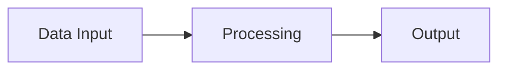
```mermaid
flowchart LR
    A["Data Input"] --> B["Processing"] --> C["Output"]
    click A call noop() "Click to learn more about data input"
    click B call noop() "Processing step details"
    click C call noop() "View output documentation"
```
````

The recommended syntax for **tooltip-only** nodes is `click nodeId call noop() "tooltip text"`. The visual provides a global `noop()` function, so Mermaid's `call` directive works without errors. This approach is the most compatible with both Power BI Desktop/Service and web browsers.

Supported syntax variants:

| Syntax | Description |
|--------|-------------|
| `click A call noop() "tooltip"` | **Recommended** — tooltip only via `call noop()` |
| `click A "URL" "tooltip"` | Node with link and tooltip |
| `click A href "URL" "tooltip"` | Same, using `href` keyword |
| `click A callback "tooltip"` | Legacy tooltip-only syntax |
| `click A "tooltip only"` | Tooltip only (no link, auto-detected) |

#### Tooltip Text Escaping

When generating tooltip text programmatically (e.g. from DAX/Power Query expressions), certain ASCII characters break the Mermaid parser. Replace them with Unicode lookalikes:

| Character | Replacement | Unicode Name |
|-----------|-------------|--------------|
| `"` | `″` | U+2033 Double Prime |
| `'` | `ʼ` | U+02BC Modifier Letter Apostrophe |
| `(` | `（` | U+FF08 Fullwidth Left Parenthesis |
| `)` | `）` | U+FF09 Fullwidth Right Parenthesis |
| `[` | `［` | U+FF3B Fullwidth Left Square Bracket |
| `]` | `］` | U+FF3D Fullwidth Right Square Bracket |
| `{` | `｛` | U+FF5B Fullwidth Left Curly Bracket |
| `}` | `｝` | U+FF5D Fullwidth Right Curly Bracket |
| `#` | `＃` | U+FF03 Fullwidth Number Sign |
| `<` | `﹤` | U+FE64 Small Less-Than Sign |
| `>` | `﹥` | U+FE65 Small Greater-Than Sign |
| `&` | `＆` | U+FF06 Fullwidth Ampersand |

Example with escaped tooltip:

````markdown
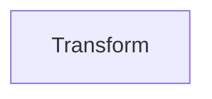
```mermaid
graph LR
    n1["Transform"]
    click n1 call noop() "Table.TransformColumnTypes（Quelle,｛｛″Unit″, type text｝｝）"
```
````

### Safe Link Handling

Links defined in Mermaid `click` directives are **not opened directly inside the visual**. Instead:

1. Clicking a linked node shows a **confirmation dialog** (Power BI's native dialog)
2. The dialog displays the **target URL** for review
3. The user can choose to **open the link in an external browser** or cancel

This prevents users from accidentally navigating away from the report and ensures safe handling of external URLs.

> 💡 **Tip:** The `Security level` setting must be set to `Loose` (default) for tooltips and click handlers to work.

## 📸 Examples

The folder [`pbi_example/`](pbi_example/) contains a sample Power BI report (`.pbix`) and screenshots that demonstrate the visual in action.

### Landing Page

When no data is connected, the visual displays a landing page with usage instructions and a built-in demo:

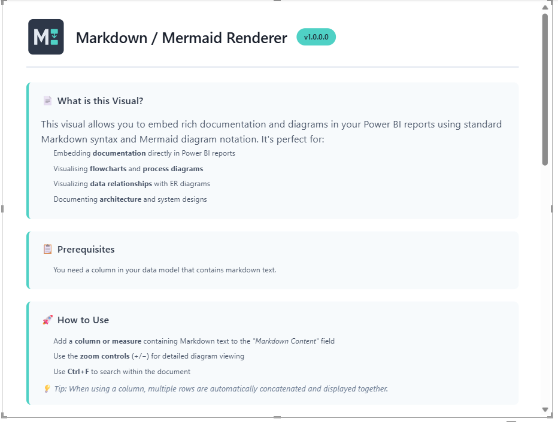

### Rendered Markdown with Mermaid Diagrams

Once a Markdown column or measure is added, the visual renders the content with full Mermaid diagram support:

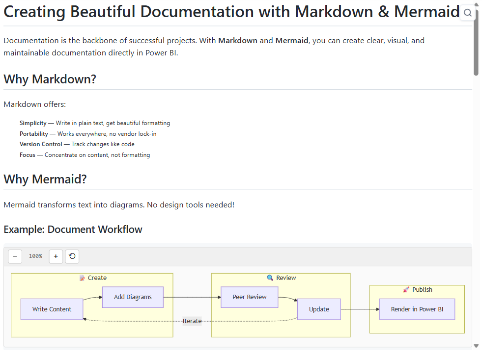

## 🎯 Built-in Demo

The visual includes a **Markdown / Mermaid Demo** section on the landing page. When no data is connected, you can:

1. View the **raw Markdown source** to see the syntax for headings, lists, tables, and Mermaid code blocks
2. Click **"Render"** to see how the Markdown is rendered with live diagrams
3. Click **"Copy Markdown"** to copy the demo text to your clipboard

This lets you quickly try out the visual by pasting the demo content into a column in your data model.

## 💡 Tip: Use AI to Generate Documentation

You can use AI tools (e.g. ChatGPT, GitHub Copilot, Claude) to automatically document your project as **Markdown with embedded Mermaid diagrams**. For example, ask the AI to:

- Generate a **flowchart** of your ETL process
- Create an **ER diagram** of your data model
- Document your **architecture** as a sequence diagram
- Summarize **business logic** with structured Markdown

Copy the generated Markdown into a **separate table** in your Power BI data model (e.g. a `Documentation` table with a single text column) and connect it to this visual. This way, your technical documentation lives directly inside your Power BI report — always up to date and easy to maintain.

Uh - And now guess only once how this file has been generated...

## �📦 Libraries & Versions

| Library | Version |
|---------|---------|
| Mermaid | 11.14.0 |
| React | 19.2.5 |
| react-md-editor | 4.1.0 (Markdown rendering) |
| Handlebars | 4.7.9 |
| DOMPurify | 3.4.0 |

---

## ⚙️ Configuration Settings

### View Settings

| Setting | Type | Default | Description |
|---------|------|---------|-------------|
| **Color mode** | Enum | `Light` | Switch between light and dark theme for the visual. Affects Markdown rendering, Mermaid diagrams, and all UI components. |
| **Copy markdown menu** | Boolean | `false` | Show a custom right-click menu with options to copy the markdown content of a single section or the entire visual to the clipboard. When disabled (default), right-click shows the standard Power BI context menu. |
| **Deduplicate values** | Boolean | `false` | Remove duplicate values per column before rendering. When enabled, each column is treated independently and only distinct values are shown. This is useful when mixing measures and columns in the same visual — without deduplication, measure values are repeated for every row of the column. |
| **Use search bar** | Boolean | `false` | Show a search bar to find and highlight text within the rendered markdown content. When enabled, a search bar with a magnifying glass icon and text input is permanently displayed above the content. Use Enter/Shift+Enter to navigate between matches, Escape to clear. |

### Mermaid Settings

| Setting | Type | Default | Description |
|---------|------|---------|-------------|
| **Layout algorithm** | Enum | `Default (from diagram)` | Layout engine used to position nodes and edges. Choose `Dagre` (Mermaid's built-in engine) or `ELK` (Eclipse Layout Kernel — better results for large or complex diagrams). `Default` lets the diagram code or frontmatter decide. |
| **ELK: Node placement** | Enum | `Default (from diagram)` | Node placement strategy when using the ELK layout engine. Options: Simple, Network Simplex, Linear Segments, Brandes Koepf. Has no effect unless Layout is set to `ELK`. |
| **ELK: Merge edges** | Enum | `Default (from diagram)` | Combine parallel edges when using the ELK layout engine. Has no effect unless Layout is set to `ELK`. |
| **Theme** | Enum | `Auto` | Color theme for diagrams. `Auto` selects light or dark automatically based on the Color mode setting. `Default (from diagram)` defers to any `%%{init: {...}}%%` frontmatter or `%%theme` directives in the diagram code. Other options: `Default`, `Dark`, `Forest`, `Neutral`, `Base`. |
| **Look** | Enum | `Default (from diagram)` | Visual style of diagrams. `Classic` uses the traditional Mermaid style; `Hand-drawn` renders a sketch-like appearance. `Default` lets the diagram code or frontmatter decide. |
| **Flowchart orientation** | Enum | `Default (from diagram)` | Override the orientation of flowchart diagrams. Choose between Top to Bottom, Bottom to Top, Left to Right, or Right to Left. `Default` uses the orientation defined in the diagram code. |
| **Max edges** | Number | `30000` | Maximum number of edges allowed in a diagram. |
| **Security level** | Enum | `Loose` | Security level for Mermaid rendering: `Loose`, `Strict`, or `Sandbox`. Loose is required for click handlers and tooltips. |

### 💡 Getting More Out of Complex Diagrams

For large or intricate diagrams — such as flowcharts with many nodes, dense ER diagrams, or deep hierarchies — the default **Dagre** layout engine can produce cluttered results with crossing edges. Switching the **Layout algorithm** to **ELK** (Eclipse Layout Kernel) often yields significantly cleaner layouts in these cases.

Beyond the layout engine, the visual settings give you several levers to indirectly control how a diagram looks — without changing the diagram code itself:

| Goal | Setting to change |
|------|------------------|
| Cleaner edge routing in complex diagrams | Layout → `ELK` |
| Reduce overlapping edges | ELK: Merge edges → `True` |
| More compact or evenly spaced nodes | ELK: Node placement → `Network Simplex` or `Brandes Koepf` |
| Match the report's dark/light theme | Theme → `Auto` |
| A softer, less technical look | Look → `Hand-drawn` |
| Change diagram direction without editing code | Flowchart orientation → `LR` / `TB` etc. |
| Scale text in all diagrams at once | Font → Mermaid font size |

> 💡 **Tip:** ELK is particularly effective for `flowchart` and `graph` diagrams. For sequence diagrams and Gantt charts, the layout engine setting has no effect — they use their own fixed rendering.

### Mermaid Debug Settings

| Setting | Type | Default | Description |
|---------|------|---------|-------------|
| **Show debug panel** | Boolean | `false` | Shows debug information including raw and processed Mermaid code |
| **HTML labels** | Boolean | `true` | Enable HTML rendering in node labels. Required for rich text formatting in labels. |
| **Markdown auto wrap** | Boolean | `true` | Enable automatic line wrapping in markdown labels |
| **Convert &lt;br&gt; to newline** | Boolean | `true` | Converts `<br/>` tags to newlines. Mermaid escapes `<br>` as text, this fixes line breaks. |
| **Auto backtick labels** | Boolean | `true` | Automatically wraps labels containing newlines in backticks. Mermaid only renders newlines in backtick-wrapped labels. |
| **Preserve line breaks CSS** | Boolean | `true` | Applies CSS to preserve line breaks in Mermaid labels (`white-space: pre-wrap`) |

### Font Settings

| Setting | Type | Default | Description |
|---------|------|---------|-------------|
| **Font family** | Font | `DIN` | Font family for Markdown content and Mermaid diagrams |
| **Heading font size (h1)** | Number | `14` | Font size in pt for the largest heading (h1). Smaller headings (h2–h6) scale down proportionally relative to the body font size. |
| **Body font size** | Number | `9` | Font size in pt for paragraphs, tables, lists, and other body text. |
| **Mermaid font size** | Number | `14` | Font size in pt for text in Mermaid diagrams. |

### Markdown Settings

| Setting | Type | Default | Description |
|---------|------|---------|-------------|
| **Enable line breaks** | Boolean | `true` | Render single line breaks in Markdown as `<br>` (line break). When disabled, consecutive lines are joined into one paragraph. |
| **Code block word wrap** | Boolean | `true` | Wrap long lines in code blocks instead of showing a horizontal scrollbar |

### Interactivity Settings

| Setting | Type | Default | Description |
|---------|------|---------|-------------|
| **Cross filter** | Boolean | `false` | When enabled, clicking on a markdown section filters other visuals based on the corresponding data row. Ctrl+Click to select multiple sections. |

> ⚠️ **Note:** Cross-filtering and section selection only work when a **column** provides the markdown data. When a single **measure** is used, there are no individual data rows to select, so cross-filtering has no effect.

### Content Formatting (per-column/measure)

This section appears in the property pane for each column or measure added to the "Markdown Content" field.

| Setting | Type | Default | Description |
|---------|------|---------|-------------|
| **Format as** | Enum | `None` | Formatting function to apply: None, Heading (H1/H2/H3), Code Block, Highlight, Definition List, Blockquote, Unordered List, or Ordered List |
| **Define language** | Text | *(empty)* | Language identifier for code block syntax highlighting (only shown when "Code Block" is selected) |
| **List delimiter** | Text | `,` | Character(s) used to split the value into list items (only shown when "Unordered List" or "Ordered List" is selected) |

### Markdown Functions

Visual-wide settings that control how definition lists and lists are rendered. These apply to all columns/measures that use the corresponding format function.

| Setting | Type | Default | Description |
|---------|------|---------|-------------|
| **Definition list heading** | Enum | `None` | Heading level (H1–H6) for the term in definition lists. "None" renders plain text. |
| **Definition list blank text** | Text | `(blank)` | Text shown when a definition list value is null or empty. Useful for localization (e.g. `n/a`, `–`, `(leer)`). |
| **List heading** | Enum | `H4` | Heading level (H1–H6) for the title of ordered and unordered lists. "None" suppresses the heading entirely. |

### Line Break Settings Explained

The three line-break settings work together to ensure `<br/>` tags render correctly in Mermaid diagrams:

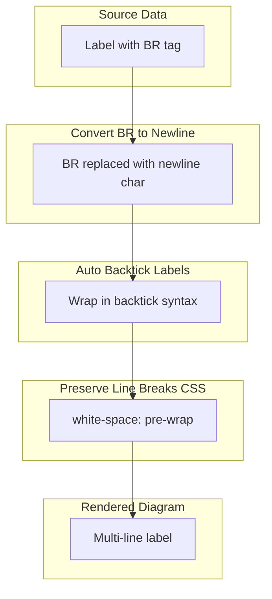
```mermaid
flowchart TD
    subgraph Input["Source Data"]
        A["Label with BR tag"]
    end
    
    subgraph S1["Convert BR to Newline"]
        B["BR replaced with newline char"]
    end
    
    subgraph S2["Auto Backtick Labels"]
        C["Wrap in backtick syntax"]
    end
    
    subgraph S3["Preserve Line Breaks CSS"]
        D["white-space: pre-wrap"]
    end
    
    subgraph Output["Rendered Diagram"]
        E["Multi-line label"]
    end
    
    A --> B --> C --> D --> E
```

**Why these are needed:**
- `htmlLabels: true` uses HTML `<foreignObject>` which escapes `<br/>` as text
- `htmlLabels: false` uses SVG `<tspan>` which handles newlines natively (but with tighter spacing)

---

## 🎨 Power BI Theme Template Support

This visual fully supports **Power BI theme templates**, allowing you to define default settings for the visual in your organization's theme file. Theme settings are applied automatically when the theme is loaded — users can still override individual settings in the property pane.

### How It Works

Power BI themes can include a `visualStyles` section that targets custom visuals by their GUID. For this visual, the GUID is:

```
markdownMermaidRenderer
```

Theme-defined values are applied as defaults. Any setting a user changes manually in the property pane takes precedence over the theme value.

### How to Apply

1. Create a `.json` file (or extend your existing theme file) with the template below
2. In Power BI Desktop, go to **View → Themes → Browse for themes**
3. Select your `.json` theme file
4. All instances of the Markdown / Mermaid Renderer visual will use the themed defaults

> 💡 **Tip:** You can combine the `visualStyles` section with other standard theme properties (colors, fonts, backgrounds) in the same file.

### Property Reference

All properties that can be themed, organized by object group:

| Object | Property | Type | Allowed Values | Default |
|--------|----------|------|----------------|---------|
| `view` | `colorMode` | enum | `"light"`, `"dark"` | `"light"` |
| `view` | `enableCopyMenu` | bool | `true`, `false` | `false` |
| `view` | `deduplicateValues` | bool | `true`, `false` | `false` |
| `font` | `fontFamily` | string | any font name | `"DIN"` |
| `font` | `headingFontSize` | number | size in pt | `14` |
| `font` | `bodyFontSize` | number | size in pt | `9` |
| `font` | `mermaidFontSize` | number | size in pt | `14` |
| `mermaid` | `layout` | enum | `"default"`, `"dagre"`, `"elk"` | `"default"` |
| `mermaid` | `elkNodePlacement` | enum | `"default"`, `"SIMPLE"`, `"NETWORK_SIMPLEX"`, `"LINEAR_SEGMENTS"`, `"BRANDES_KOEPF"` | `"default"` |
| `mermaid` | `elkMergeEdges` | enum | `"default"`, `"true"`, `"false"` | `"default"` |
| `mermaid` | `theme` | enum | `"auto"`, `"none"`, `"default"`, `"dark"`, `"forest"`, `"neutral"`, `"base"` | `"auto"` |
| `mermaid` | `look` | enum | `"default"`, `"classic"`, `"handDrawn"` | `"default"` |
| `mermaid` | `flowchartOrientation` | enum | `"default"`, `"TB"`, `"BT"`, `"LR"`, `"RL"` | `"default"` |
| `mermaid` | `maxEdges` | number | any positive integer | `30000` |
| `mermaid` | `securityLevel` | enum | `"loose"`, `"strict"`, `"sandbox"` | `"loose"` |
| `mermaidDebug` | `showDebugPanel` | bool | `true`, `false` | `false` |
| `mermaidDebug` | `htmlLabels` | bool | `true`, `false` | `true` |
| `mermaidDebug` | `markdownAutoWrap` | bool | `true`, `false` | `true` |
| `mermaidDebug` | `convertBrToNewline` | bool | `true`, `false` | `true` |
| `mermaidDebug` | `autoBacktickLabels` | bool | `true`, `false` | `true` |
| `mermaidDebug` | `preserveLineBreaksCSS` | bool | `true`, `false` | `true` |
| `markdown` | `enableLineBreaks` | bool | `true`, `false` | `true` |
| `markdown` | `codeBlockWordWrap` | bool | `true`, `false` | `true` |
| `interactivity` | `enableCrossFilter` | bool | `true`, `false` | `false` |
| `measureFormat` | `formatFunction` | enum | `"none"`, `"heading_h1"`, `"heading_h2"`, `"heading_h3"`, `"code_block"`, `"highlight"`, `"definition_list"`, `"blockquote"`, `"list_unordered"`, `"list_ordered"` | `"none"` |
| `measureFormat` | `codeLanguage` | string | any language identifier | `""` |
| `measureFormat` | `listDelimiter` | string | any delimiter character(s) | `","` |
| `markdownFunctions` | `definitionHeadingLevel` | enum | `"none"`, `"h1"`, `"h2"`, `"h3"`, `"h4"`, `"h5"`, `"h6"` | `"none"` |
| `markdownFunctions` | `blankText` | string | any text | `"(blank)"` |
| `markdownFunctions` | `listHeadingLevel` | enum | `"none"`, `"h1"`, `"h2"`, `"h3"`, `"h4"`, `"h5"`, `"h6"` | `"h4"` |

> **Note:** `measureFormat` properties are per-column instances bound via `selector: { metadata: queryName }`. They apply individually to each measure in the field well. `markdownFunctions` properties are visual-wide and apply to all columns/measures.

### Full Theme Template (Copy & Paste Ready)

Copy this complete template into a `.json` file. Remove or adjust any properties you don't need — only the properties you include will be overridden.

```json
{
    "name": "My Theme with Mermaid Visual Settings",
    "visualStyles": {
        "markdownMermaidRenderer": {
            "*": {
                "view": [{
                    "colorMode": "light",
                    "enableCopyMenu": false,
                    "deduplicateValues": false
                }],
                "font": [{
                    "fontFamily": "DIN",
                    "headingFontSize": 14,
                    "bodyFontSize": 9,
                    "mermaidFontSize": 14
                }],
                "mermaid": [{
                    "layout": "default",
                    "elkNodePlacement": "default",
                    "elkMergeEdges": "default",
                    "theme": "auto",
                    "look": "default",
                    "flowchartOrientation": "default",
                    "maxEdges": 30000,
                    "securityLevel": "loose"
                }],
                "mermaidDebug": [{
                    "showDebugPanel": false,
                    "htmlLabels": true,
                    "markdownAutoWrap": true,
                    "convertBrToNewline": true,
                    "autoBacktickLabels": true,
                    "preserveLineBreaksCSS": true
                }],
                "markdown": [{
                    "enableLineBreaks": true,
                    "codeBlockWordWrap": true
                }],
                "interactivity": [{
                    "enableCrossFilter": false
                }],
                "markdownFunctions": [{
                    "definitionHeadingLevel": "none",
                    "blankText": "(blank)",
                    "listHeadingLevel": "h4"
                }]
            }
        }
    }
}
```

### Minimal Example: Corporate Dark Theme

If you only want to set a few defaults (e.g. dark mode with a specific font), you only need to include those properties:

```json
{
    "name": "Corporate Dark Theme",
    "visualStyles": {
        "markdownMermaidRenderer": {
            "*": {
                "view": [{
                    "colorMode": "dark"
                }],
                "font": [{
                    "fontFamily": "Segoe UI",
                    "bodyFontSize": 11,
                    "headingFontSize": 16
                }]
            }
        }
    }
}
```

### Extending an Existing Theme

You can add the `visualStyles` block to any existing Power BI theme file. For example, if you already have a theme with custom colors:

```json
{
    "name": "My Corporate Theme",
    "dataColors": ["#1a73e8", "#34a853", "#fbbc04", "#ea4335"],
    "background": "#ffffff",
    "foreground": "#202124",
    "visualStyles": {
        "markdownMermaidRenderer": {
            "*": {
                "view": [{ "colorMode": "light" }],
                "font": [{
                    "fontFamily": "Segoe UI",
                    "bodyFontSize": 10
                }],
                "mermaid": [{
                    "flowchartOrientation": "LR"
                }]
            }
        }
    }
}
```

---

## 🛠️ Technical Documentation

### Architecture Overview

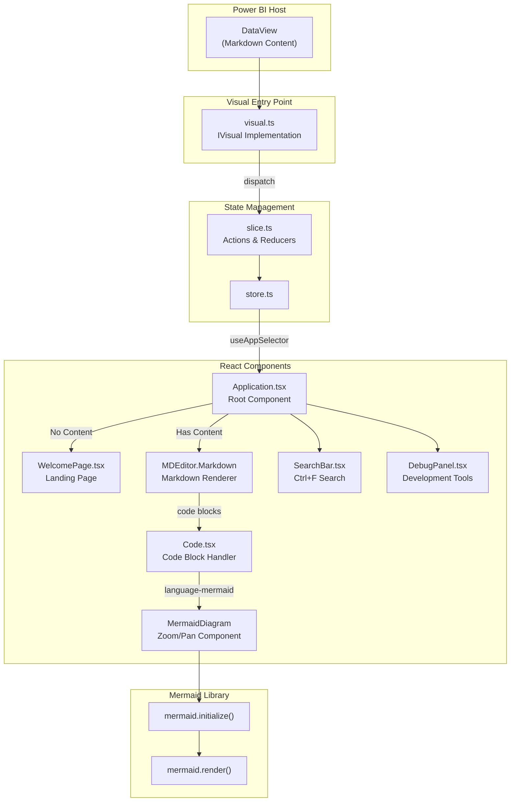
```mermaid
flowchart TB
    subgraph PowerBI["Power BI Host"]
        DV["DataView\n(Markdown Content)"]
    end
    
    subgraph Visual["Visual Entry Point"]
        VT["visual.ts\nIVisual Implementation"]
    end
    
    subgraph Redux["State Management"]
        ST["store.ts"]
        SL["slice.ts\nActions & Reducers"]
    end
    
    subgraph React["React Components"]
        APP["Application.tsx\nRoot Component"]
        WP["WelcomePage.tsx\nLanding Page"]
        MD["MDEditor.Markdown\nMarkdown Renderer"]
        CODE["Code.tsx\nCode Block Handler"]
        MERM["MermaidDiagram\nZoom/Pan Component"]
        SB["SearchBar.tsx\nCtrl+F Search"]
        DP["DebugPanel.tsx\nDevelopment Tools"]
    end
    
    subgraph Mermaid["Mermaid Library"]
        MI["mermaid.initialize()"]
        MR["mermaid.render()"]
    end
    
    DV --> VT
    VT -->|"dispatch"| SL
    SL --> ST
    ST -->|"useAppSelector"| APP
    APP -->|"No Content"| WP
    APP -->|"Has Content"| MD
    MD -->|"code blocks"| CODE
    CODE -->|"language-mermaid"| MERM
    MERM --> MI --> MR
    APP --> SB
    APP --> DP
```

### Component Hierarchy

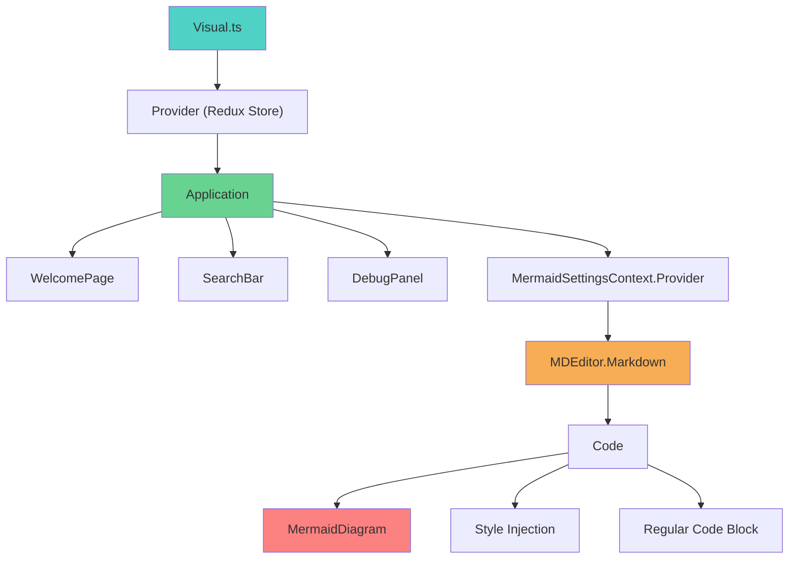
```mermaid
flowchart TD
    V["Visual.ts"] --> P["Provider (Redux Store)"]
    P --> A["Application"]
    A --> W["WelcomePage"]
    A --> S["SearchBar"]
    A --> D["DebugPanel"]
    A --> CTX["MermaidSettingsContext.Provider"]
    CTX --> M["MDEditor.Markdown"]
    M --> C["Code"]
    C --> MD["MermaidDiagram"]
    C --> ST["Style Injection"]
    C --> CD["Regular Code Block"]
    
    style V fill:#4FD1C5
    style A fill:#68D391
    style M fill:#F6AD55
    style MD fill:#FC8181
```

### Data Flow

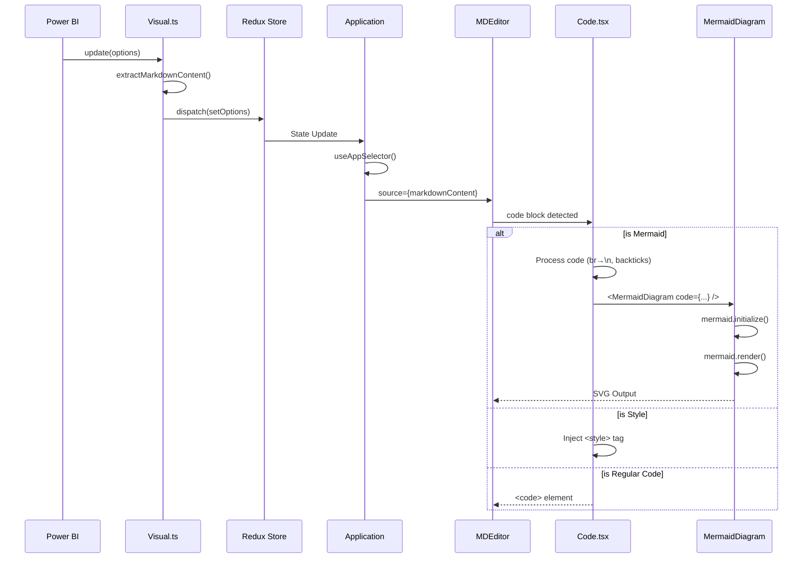
```mermaid
sequenceDiagram
    participant PBI as Power BI
    participant V as Visual.ts
    participant R as Redux Store
    participant A as Application
    participant M as MDEditor
    participant C as Code.tsx
    participant D as MermaidDiagram
    
    PBI->>V: update(options)
    V->>V: extractMarkdownContent()
    V->>R: dispatch(setOptions)
    R->>A: State Update
    A->>A: useAppSelector()
    A->>M: source={markdownContent}
    M->>C: code block detected
    
    alt is Mermaid
        C->>C: Process code (br→\n, backticks)
        C->>D: <MermaidDiagram code={...} />
        D->>D: mermaid.initialize()
        D->>D: mermaid.render()
        D-->>M: SVG Output
    else is Style
        C->>C: Inject <style> tag
    else is Regular Code
        C-->>M: <code> element
    end
```

### File Structure

```
src/
├── visual.ts              # Power BI IVisual implementation
├── Application.tsx        # Root React component
├── Code.tsx               # Code block handler (Mermaid, styles)
├── dax-language.ts        # DAX & Power Query syntax registration
├── WelcomePage.tsx        # Landing page when no content
├── SearchBar.tsx          # Ctrl+F search functionality
├── DebugPanel.tsx         # Development debugging panel
├── Error.tsx              # Error boundary component
├── settings.ts            # Visual settings definitions
├── utils.ts               # Markdown extraction, sanitization
├── helpers.ts             # Utility functions
└── redux/
    ├── store.ts           # Redux store configuration
    ├── slice.ts           # State slice with actions/reducers
    └── hooks.ts           # Typed useAppSelector/useAppDispatch
```

### Mermaid Code Processing Pipeline

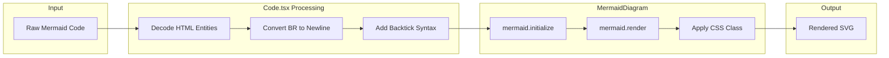
```mermaid
flowchart LR
    subgraph Input
        RAW["Raw Mermaid Code"]
    end
    
    subgraph Processing["Code.tsx Processing"]
        DE["Decode HTML Entities"]
        BR["Convert BR to Newline"]
        BT["Add Backtick Syntax"]
    end
    
    subgraph Rendering["MermaidDiagram"]
        INIT["mermaid.initialize"]
        RENDER["mermaid.render"]
        CSS["Apply CSS Class"]
    end
    
    subgraph Output
        SVG["Rendered SVG"]
    end
    
    RAW --> DE --> BR --> BT --> INIT --> RENDER --> CSS --> SVG
```

### Settings Context Flow

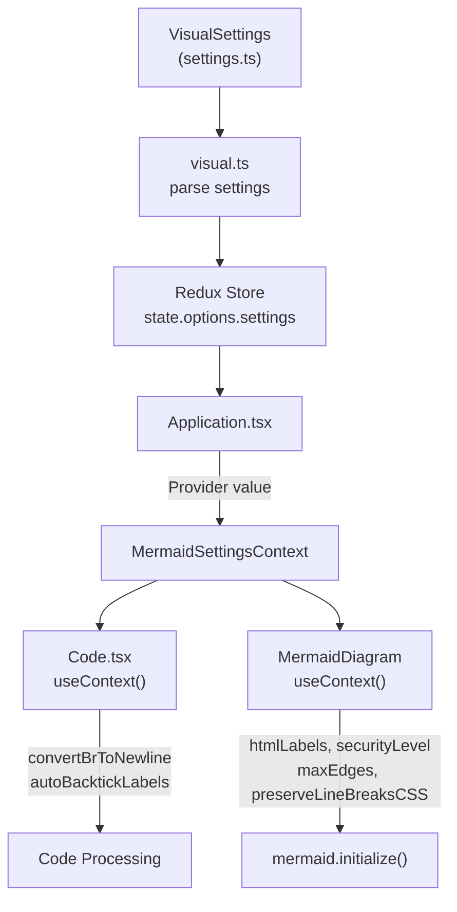
```mermaid
flowchart TD
    VS["VisualSettings\n(settings.ts)"]
    VT["visual.ts\nparse settings"]
    RD["Redux Store\nstate.options.settings"]
    APP["Application.tsx"]
    CTX["MermaidSettingsContext"]
    CODE["Code.tsx\nuseContext()"]
    MERM["MermaidDiagram\nuseContext()"]
    
    VS --> VT --> RD --> APP
    APP -->|"Provider value"| CTX
    CTX --> CODE
    CTX --> MERM
    
    CODE -->|"convertBrToNewline\nautoBacktickLabels"| PROC["Code Processing"]
    MERM -->|"htmlLabels, securityLevel\nmaxEdges, preserveLineBreaksCSS"| INIT["mermaid.initialize()"]
```

### Zoom & Pan State Machine

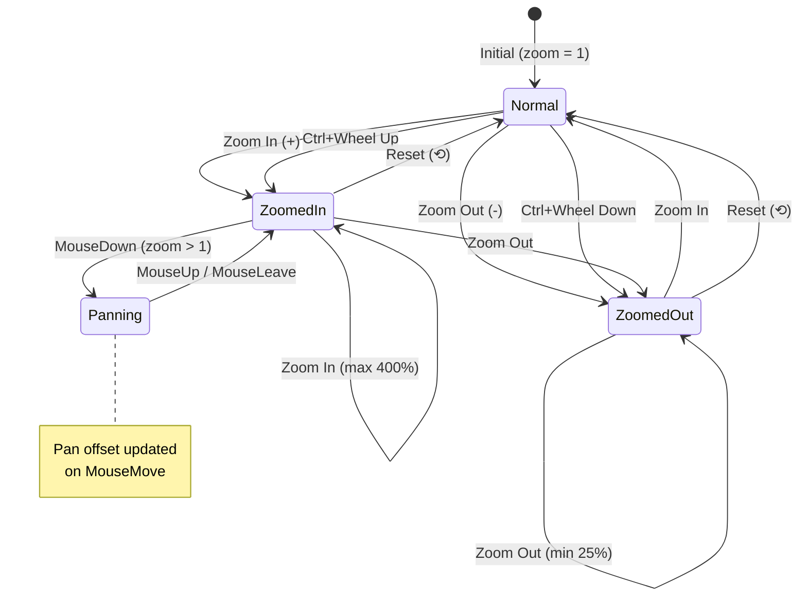
```mermaid
stateDiagram-v2
    [*] --> Normal: Initial (zoom = 1)
    
    Normal --> ZoomedIn: Zoom In (+)
    Normal --> ZoomedOut: Zoom Out (-)
    Normal --> ZoomedIn: Ctrl+Wheel Up
    Normal --> ZoomedOut: Ctrl+Wheel Down
    
    ZoomedIn --> Panning: MouseDown (zoom > 1)
    ZoomedIn --> Normal: Reset (⟲)
    ZoomedIn --> ZoomedIn: Zoom In (max 400%)
    ZoomedIn --> ZoomedOut: Zoom Out
    
    ZoomedOut --> Normal: Zoom In
    ZoomedOut --> ZoomedOut: Zoom Out (min 25%)
    ZoomedOut --> Normal: Reset (⟲)
    
    Panning --> ZoomedIn: MouseUp / MouseLeave
    
    note right of Panning
        Pan offset updated
        on MouseMove
    end note
```

---

## 🔧 Development

### Prerequisites

- Node.js 18+
- Yarn package manager
- Power BI Desktop with Developer Mode enabled

### Setup

```bash
# Install dependencies
yarn install

# Start development server (hot reload)
yarn start

# Build production package
yarn package

# Run linting
yarn lint
yarn lintfix
```

### Testing Locally

1. Run `yarn start` to start the dev server
2. Enable Developer Mode in Power BI Desktop
3. Add "Developer Visual" to your report
4. Add a column or measure with Markdown text
5. Changes hot-reload automatically

---

## � Security & Certification Compliance

This visual is designed to meet **Microsoft Power BI certification requirements**. It operates entirely offline with no external communication.

### No External Communication

**This visual does not communicate with any external services or resources.**

The following measures ensure complete isolation:

| Measure | Implementation |
|---------|----------------|
| **No network requests** | No `fetch()`, `XMLHttpRequest`, or `WebSocket` calls in the codebase |
| **Empty privileges** | `capabilities.json` contains `"privileges": []` - no web access requested |
| **No external URLs** | All resources are bundled; no CDN or external script loading |
| **Offline rendering** | Mermaid diagrams are rendered entirely client-side |

### DOM Security

User-provided content is sanitized to prevent XSS attacks:

| Component | Sanitization Method |
|-----------|---------------------|
| **Markdown content** | Sanitized via `rehype-sanitize` with strict schema |
| **HTML content** | Sanitized via `DOMPurify` with comprehensive config |
| **Mermaid SVG output** | Rendered by Mermaid library, inserted as SVG elements |

### DOMPurify Configuration

The visual uses a strict DOMPurify configuration that:

- **Forbids** all event handler attributes (`onclick`, `onerror`, `onload`, etc.)
- **Forbids** dangerous tags (`script`, `iframe`, `object`, `embed`, etc.)
- **Forbids** external URL protocols
- **Allows** SVG and HTML profiles for diagram rendering
- **Sanitizes** all user input before DOM insertion

### innerHTML Usage

Where `innerHTML` is used, it is explicitly marked with ESLint disable comments and justified:

1. **Mermaid SVG rendering** - Required to insert Mermaid's generated SVG output
2. **HTML entity decoding** - Uses a detached textarea element (safe pattern)
3. **Style injection** - User-defined styles with React's `dangerouslySetInnerHTML`
4. **Handlebars axis rendering** - SVG generation for D3 axes

All `innerHTML` usage involves either:
- Library-generated content (Mermaid SVG)
- Controlled non-executable content (textarea for entity decoding)
- User-acknowledged custom styling (Style code blocks)

### Certification Checklist

| Requirement | Status |
|-------------|--------|
| No external HTTP/HTTPS requests | ✅ |
| No WebSocket connections | ✅ |
| No `fetch()` or `XMLHttpRequest` | ✅ |
| No `eval()` or `new Function()` | ✅ |
| Privileges array is empty | ✅ |
| DOM manipulation is sanitized | ✅ |
| Only public OSS dependencies | ✅ |
| TypeScript source code | ✅ |
| ESLint with powerbi-visuals plugin | ✅ |

---

## �👤 Author

**Paul Moldmann**

*Special thanks to **Ilfat Galiev** who originally created this visual, which has been adapted and enhanced.*

---

## 📄 License

GNU General Public License v3.0 — see [LICENSE](LICENSE) for details.
