# Markdown / Mermaid Renderer for Power BI


A Power BI custom visual that renders **Markdown** content with embedded **Mermaid diagrams**. Transform your text-based content into beautifully formatted documentation, flowcharts, sequence diagrams, and more — directly within your Power BI reports.

## 📄 What is this Visual?

This visual allows you to embed rich documentation and diagrams in your Power BI reports using standard Markdown syntax and Mermaid diagram notation. It's perfect for:

- Embedding **documentation** directly in Power BI reports
- Visualising **flowcharts** and **process diagrams**
- Visualizing **data relationships** with ER diagrams
- Documenting **architecture** and system designs
- Adding **dynamic content** using Handlebars templates

## Prerequisites
- You need a column in your data model that contains markdown text.

## 🚀 How to Use

1. Add a **column or measure** containing Markdown text to the *"Markdown Content"* field
2. Write standard Markdown syntax in your data source
3. For diagrams, use Mermaid code blocks: ` ```mermaid `
4. Use the **zoom controls** (+/−) for detailed diagram viewing
5. Use **Ctrl+F** to search within the document

> 💡 **Tip:** When using a column, multiple rows are automatically concatenated and displayed together.

### Example Markdown with Mermaid

```markdown
# Project Status

Here's the current workflow:

` ` `mermaid
flowchart LR
    A["Data Input"] --> B["Processing"]
    B --> C["Output"]
` ` `

## Details

- Step 1: Gather data
- Step 2: Process
- Step 3: Deliver
```

## 📦 Libraries & Versions

| Library | Version |
|---------|---------|
| Mermaid | 11.12.3 |
| React | 18.2.0 |
| react-md-editor | 4.0.4 (Markdown rendering) |
| Handlebars | 4.7.8 |
| DOMPurify | 3.2.6 |

---

## ⚙️ Configuration Settings

### View Settings

| Setting | Type | Default | Description |
|---------|------|---------|-------------|
| **Show empty message** | Boolean | `true` | Shows a welcome page when no markdown content is provided |
| **Show debug panel** | Boolean | `false` | Shows debug information including raw and processed Mermaid code |

### Mermaid Settings

| Setting | Type | Default | Description |
|---------|------|---------|-------------|
| **HTML labels** | Boolean | `true` | Enable HTML rendering in node labels. Required for rich text formatting in labels. |
| **Markdown auto wrap** | Boolean | `true` | Enable automatic line wrapping in markdown labels |
| **Security level** | Enum | `Loose` | Security level for Mermaid rendering: `Loose`, `Strict`, or `Sandbox`. Loose is required for click handlers. |
| **Max edges** | Number | `30000` | Maximum number of edges allowed in a diagram |
| **Convert &lt;br&gt; to newline** | Boolean | `true` | Converts `<br/>` tags to newlines. Mermaid escapes `<br>` as text, this fixes line breaks. |
| **Auto backtick labels** | Boolean | `true` | Automatically wraps labels containing newlines in backticks. Mermaid only renders newlines in backtick-wrapped labels. |
| **Preserve line breaks CSS** | Boolean | `true` | Applies CSS to preserve line breaks in Mermaid labels (`white-space: pre-wrap`) |

### Line Break Settings Explained

The three line-break settings work together to ensure `<br/>` tags render correctly in Mermaid diagrams:


**Why these are needed:**
- `htmlLabels: true` uses HTML `<foreignObject>` which escapes `<br/>` as text
- `htmlLabels: false` uses SVG `<tspan>` which handles newlines natively (but with tighter spacing)

---

## 🛠️ Technical Documentation

### Architecture Overview


### Component Hierarchy


### Data Flow


### File Structure

```
src/
├── visual.ts              # Power BI IVisual implementation
├── Application.tsx        # Root React component
├── Code.tsx               # Code block handler (Mermaid, styles)
├── WelcomePage.tsx        # Landing page when no content
├── SearchBar.tsx          # Ctrl+F search functionality
├── DebugPanel.tsx         # Development debugging panel
├── Error.tsx              # Error boundary component
├── settings.ts            # Visual settings definitions
├── utils.ts               # Markdown extraction, sanitization
├── helpers.ts             # Utility functions
└── redux/
    ├── store.ts           # Redux store configuration
    ├── slice.ts           # State slice with actions/reducers
    └── hooks.ts           # Typed useAppSelector/useAppDispatch
```

### Mermaid Code Processing Pipeline


### Settings Context Flow


### Zoom & Pan State Machine

```mermaid
stateDiagram-v2
    [*] --> Normal: Initial (zoom = 1)
    
    Normal --> ZoomedIn: Zoom In (+)
    Normal --> ZoomedOut: Zoom Out (-)
    Normal --> ZoomedIn: Ctrl+Wheel Up
    Normal --> ZoomedOut: Ctrl+Wheel Down
    
    ZoomedIn --> Panning: MouseDown (zoom > 1)
    ZoomedIn --> Normal: Reset (⟲)
    ZoomedIn --> ZoomedIn: Zoom In (max 400%)
    ZoomedIn --> ZoomedOut: Zoom Out
    
    ZoomedOut --> Normal: Zoom In
    ZoomedOut --> ZoomedOut: Zoom Out (min 25%)
    ZoomedOut --> Normal: Reset (⟲)
    
    Panning --> ZoomedIn: MouseUp / MouseLeave
    
    note right of Panning
        Pan offset updated
        on MouseMove
    end note
```



---

## 🔧 Development

### Prerequisites

- Node.js 18+
- Yarn package manager
- Power BI Desktop with Developer Mode enabled

### Setup

```bash
# Install dependencies
yarn install

# Start development server (hot reload)
yarn start

# Build production package
yarn package

# Run linting
yarn lint
yarn lintfix
```

### Testing Locally

1. Run `yarn start` to start the dev server
2. Enable Developer Mode in Power BI Desktop
3. Add "Developer Visual" to your report
4. Add a column or measure with Markdown text
5. Changes hot-reload automatically

---

## � Security & Certification Compliance

This visual is designed to meet **Microsoft Power BI certification requirements**. It operates entirely offline with no external communication.

### No External Communication

**This visual does not communicate with any external services or resources.**

The following measures ensure complete isolation:

| Measure | Implementation |
|---------|----------------|
| **No network requests** | No `fetch()`, `XMLHttpRequest`, or `WebSocket` calls in the codebase |
| **Empty privileges** | `capabilities.json` contains `"privileges": []` - no web access requested |
| **No external URLs** | All resources are bundled; no CDN or external script loading |
| **Offline rendering** | Mermaid diagrams are rendered entirely client-side |

### DOM Security

User-provided content is sanitized to prevent XSS attacks:

| Component | Sanitization Method |
|-----------|---------------------|
| **Markdown content** | Sanitized via `rehype-sanitize` with strict schema |
| **HTML content** | Sanitized via `DOMPurify` with comprehensive config |
| **Mermaid SVG output** | Rendered by Mermaid library, inserted as SVG elements |

### DOMPurify Configuration

The visual uses a strict DOMPurify configuration that:

- **Forbids** all event handler attributes (`onclick`, `onerror`, `onload`, etc.)
- **Forbids** dangerous tags (`script`, `iframe`, `object`, `embed`, etc.)
- **Forbids** external URL protocols
- **Allows** SVG and HTML profiles for diagram rendering
- **Sanitizes** all user input before DOM insertion

### innerHTML Usage

Where `innerHTML` is used, it is explicitly marked with ESLint disable comments and justified:

1. **Mermaid SVG rendering** - Required to insert Mermaid's generated SVG output
2. **HTML entity decoding** - Uses a detached textarea element (safe pattern)
3. **Style injection** - User-defined styles with React's `dangerouslySetInnerHTML`
4. **Handlebars axis rendering** - SVG generation for D3 axes

All `innerHTML` usage involves either:
- Library-generated content (Mermaid SVG)
- Controlled non-executable content (textarea for entity decoding)
- User-acknowledged custom styling (Style code blocks)

### Certification Checklist

| Requirement | Status |
|-------------|--------|
| No external HTTP/HTTPS requests | ✅ |
| No WebSocket connections | ✅ |
| No `fetch()` or `XMLHttpRequest` | ✅ |
| No `eval()` or `new Function()` | ✅ |
| Privileges array is empty | ✅ |
| DOM manipulation is sanitized | ✅ |
| Only public OSS dependencies | ✅ |
| TypeScript source code | ✅ |
| ESLint with powerbi-visuals plugin | ✅ |

---

## �👤 Author

**Paul Moldmann**

*Special thanks to **Ilfat Galiev** who originally created this visual, which has been adapted and enhanced.*

---

## 📄 License

MIT License - see [LICENSE](LICENSE) for details.
